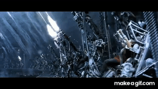
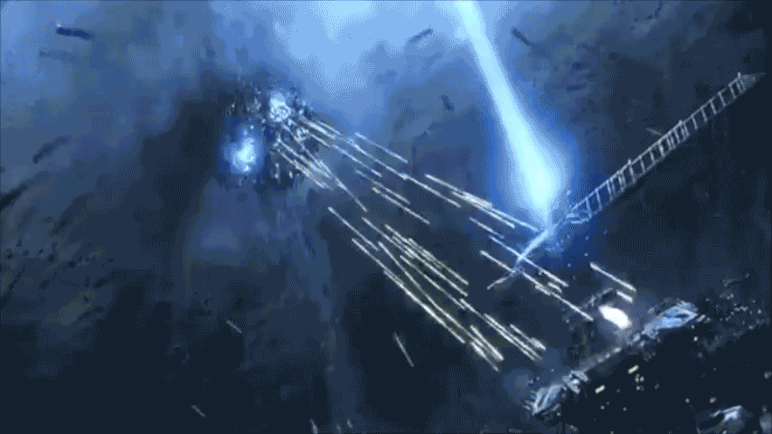

# Project Mifune

Rapid prototyping gameplay that aims to capture the feeling of the loading dock breech scene from The Matrix: Revolutions.

Specifically, I'm hoping to capture the APU army's bullet-hose being opened up on the unending hoards of Sentinels.

The thinking right now is that the Surviors-like genere is a good match, given that the scene ends in this moment of hopelessness.

